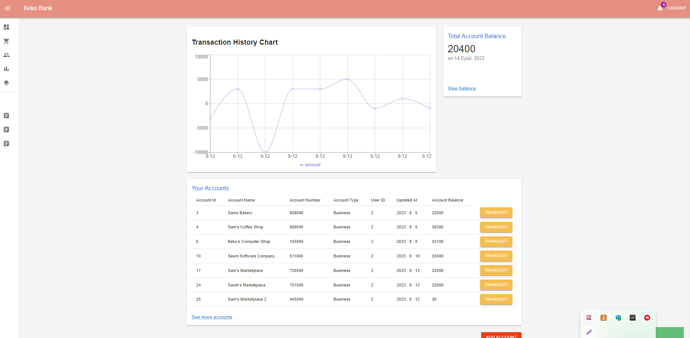

# Online Banking Full Stack Project (Frontend) – README

This is a full-stack Online Banking Application. You can access the frontend codebase in this repository. This README focuses on the **frontend**.

> 🔗 **Frontend Project:** [BankingApplication-](https://github.com/janisark/BankingApplication-)

---

## 🔍 Project Overview

This frontend is built with **React** and **Redux**, and is a complete single-page application (SPA). All components are connected to the Redux Store, ensuring that state changes in one component are reflected in all relevant parts of the application.

### 👤 Key Features for Users:
- Register & login
- View account history
- Open new accounts
- Transfer funds between accounts
- Deposit & withdraw money
- Make payments
- View real-time charts showing account flow

The frontend constantly interacts with the backend, ensuring smooth and dynamic user experiences.

---

## 📸 Project Images

| Login Page | Dashboard | Account Details |
|------------|-----------|-----------------|
|  |  |  |
|  |  |

---

## 🚀 Features

- Built with **React** & **Redux**
- SPA (Single Page Application)
- Responsive Design with **Material UI**
- Real-time chart updates
- Secure and user-friendly

---

## 🔧 Getting Started

Clone the repo and install dependencies:

```bash
git clone https://github.com/janisark/BankingApplication-.git
cd BankingApplication-
npm install
npm run start


🧰 Technologies Used :---
-> Language: JavaScript
-> Frontend: React, Redux, Redux Thunk, React Router DOM
-> UI Library: Material UI
-> Backend: Spring Boot (you can connect it to your own REST API)

🔁 Related Projects
-> If you are building or planning to build the backend, consider using Java Spring Boot to create a RESTful API.

📚 Lessons Learned
-> React & Redux integration
-> Redux Thunk for async handling
-> Connecting frontend with REST APIs
-> CORS policy handling
-> Material UI usage
-> JWT and cookie-based authentication

👨‍💻 Author
Created & maintained by @janisark
